# (C# 코딩) 에코 메신저

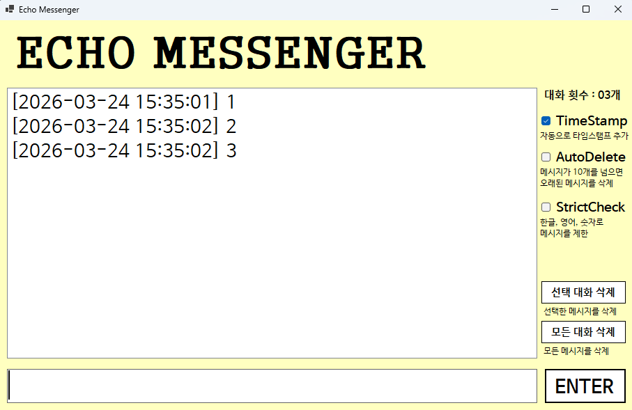

*최종 실행 화면 미리보기*

## 개요
- C# 프로그래밍 학습
- 1줄 소개: 사용자가 입력한 메시지를 그대로 출력하는 간단한 콘솔 애플리케이션
- 사용한 플랫폼:
  - C#, .NET Windows Forms, Visual Studio, GitHub
- 사용한 컨트롤:
  - TextBox: 사용자 입력을 받는 컨트롤
  - Button: 메시지를 출력하는 트리거 역할을 하는 컨트롤
  - Label: 출력된 메시지를 표시하는 컨트롤
  - CheckBox: 추가 기능을 활성화하는 옵션을 제공하는 컨트롤
- 사용한 기술과 구현한 기능:
  - Visual Studio의 Designer를 활용하여 UI 구성
  - string 클래스를 이용해 사용자 입력을 처리하고 출력
  - DateTime 클래스를 활용하여 메시지 출력 시각을 표시하는 기능 구현
  - CheckBox를 통해 메시지 출력 시각 표시 기능을 활성화/비활성화하는 기능 구현
  - list 클래스를 활용하여 사용자 입력 메시지를 저장하고, 이전 메시지를 출력하는 기능 구현
  - messageBox 클래스를 활용하여 사용자에게 알림 메시지를 표시하는 기능 구현
  - clientsize 속성을 활용하여 애플리케이션 창의 크기를 조절하는 기능 구현
  - 메소드로 코드를 구조화하여 유지보수성을 높이는 기능 구현

# 각 과제별 실행 화면

## 실행 화면 (과제1)
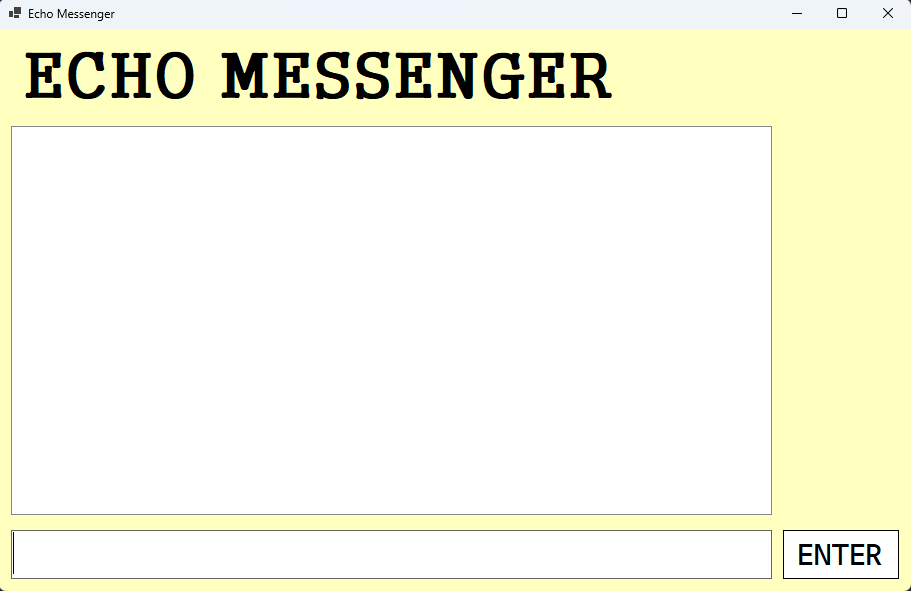

*초기 화면으로, Label에 "Echo Messenger"라는 제목이 표시되고, TextBox와 Button이 배치되어 있습니다.*

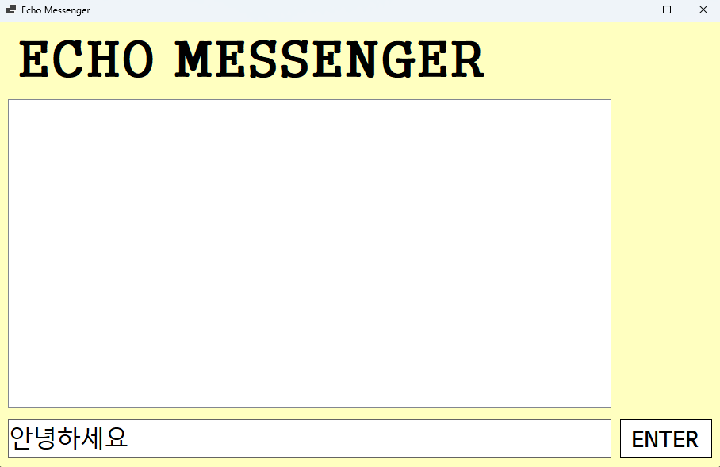

*사용자는 TextBox에 메시지를 입력할 수 있습니다.*

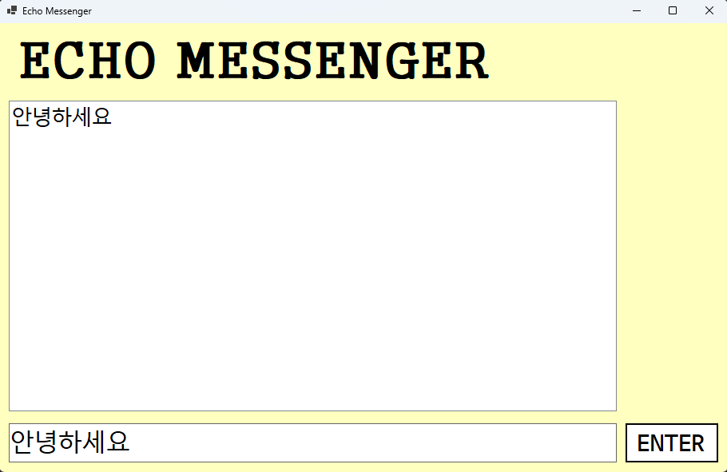

*ENTER 버튼을 클릭하면, TextBox에 입력된 메시지가 ListBox에 추가됩니다.*

- 과제 내용
	- Label(표시), TextBox(입력), Button(전송), ListBox(대화창)를 적절히 배치합니다.
	- 전송 버튼 클릭시 TextBox의 텍스트를ListBox의 항목(Items)으로 추가합니다.
	- 추가 직후 TextBox의 내용을 비워(Clear) 다음 입력을 준비합니다.

- 구현 내용과 기능 설명
	- designer를 활용하여 TextBox, Button, Label 컨트롤을 배치하여 UI 구성
	- label을 배치하여 Echo Messenger라는 제목을 표시
	- textbox를 배치하고 사용자가 입력한 메시지를 받도록 설정
	- button을 배치하고 ENTER 텍스트를 추가
	- listbox를 배치하고 사용자가 입력한 메시지를 대화창에 표시하도록 설정
	- ENTER 버튼 클릭 이벤트 핸들러를 구현하여 TextBox의 텍스트를 ListBox에 추가

## 실행 화면 (과제2)

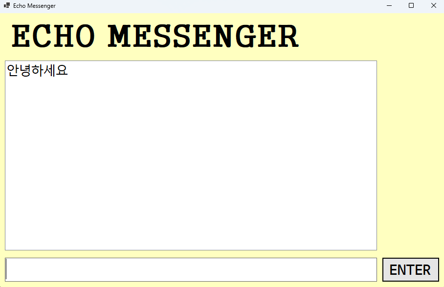

*ENTER 버튼 또는 Enter 키 입력 후 메시지가 ListBox에 추가되고, 입력창이 비워진 상태입니다.*

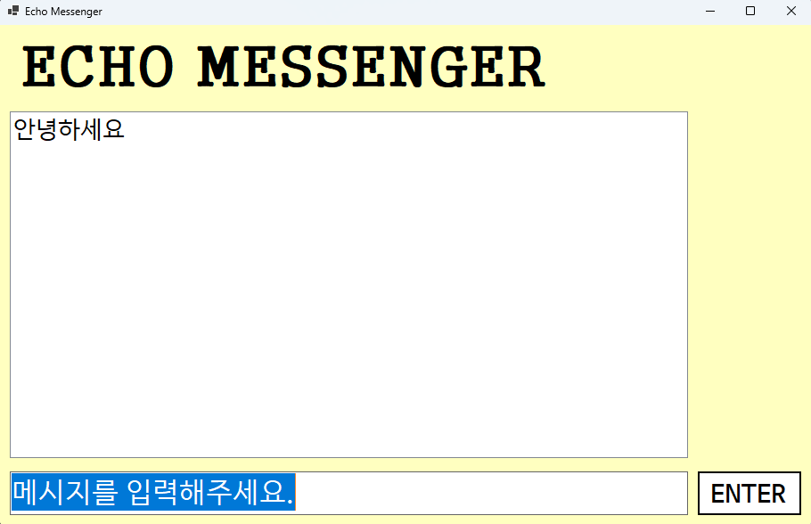

*내용이 없을 시 전송을 방지하고 '메시지를 입력해주세요' 문구를 입력시킵니다.*

- 과제 내용
	- 전송이 끝나면 입력창에 남겨진 기존 메시지를 삭제합니다.
	- 전송 후에 마우스로 입력창을 다시 클릭하지 않아도 되도록 커서를 자동으로 입력창에 둡니다.
	- 마우스 클릭 대신 키보드의 Enter 키를 눌러도 메시지가 전송되도록 합니다.
	- 내용이 없는 빈 문자열이나 공백(Space)만 있을 때는 메시지가 전송되지 않도록 방지합니다.

- 구현 내용과 기능 설명
	- TextBox의 Clear() 메소드를 사용하여 메시지 전송 후 입력창을 비웁니다.
	- TextBox의 Focus() 메소드를 사용하여 메시지 전송 후 커서를 입력창에 자동으로 위치시킵니다.
	- Form의 KeyDown 이벤트를 활용하여 Enter 키 입력을 감지하고, 메시지 전송 로직을 호출하도록 구현합니다.
	- string.IsNullOrWhiteSpace() 메소드를 사용하여 입력된 메시지가 빈 문자열이거나 공백만으로 이루어져 있는지 확인하고, 메시지 전송을 차단합니다.

## 실행 화면 (과제3)

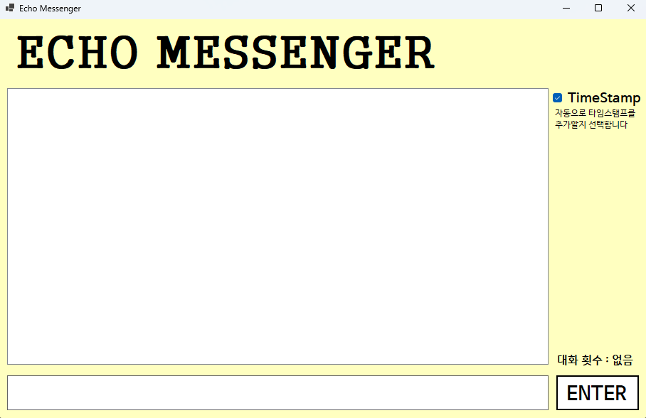

*타임스탬프 체크박스를 추가했습니다. (초기 상태 : 활성화)*

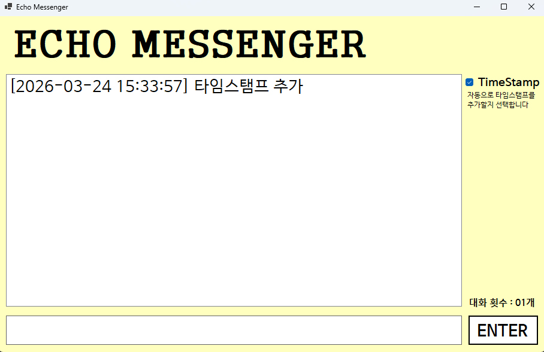

*타임스탬프 체크박스를 활성화하여 메시지 앞에 시간을 붙입니다.*

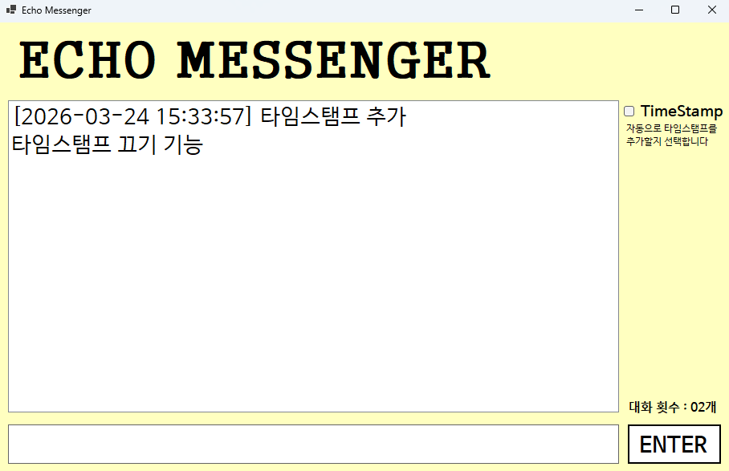

*타임스탬프 체크박스를 해제하면 기능이 해제됩니다.*
*대화가 누적되면서 메시지 개수 Label이 함께 갱신됩니다.*

- 과제 내용
	- 메시지 앞에 현재 시간([14:20:05)])을 자동으로 결합하여 리스트에 출력합니다.
	- 현재 리스트에 쌓인 총 메시지 개수를 계산하여 하단 Label에 실시간으로 업데이트합니다.
	- 예: "현재 대화: 12개"
	- 사용자가 입력한 메시지의 앞뒤 불필요한 공백을 Trim() 함수로 제거하여 저장합니다.

- 구현 내용과 기능 설명
	- DateTime.Now를 문자열로 변환해 메시지 앞에 붙이는 메소드를 구현했습니다.
	- 체크박스 상태를 확인해 타임스탬프 적용 여부를 결정할 수 있습니다.
	- 메시지를 추가하면 대화 횟수 Label을 갱신됩니다.
	- Trim()으로 앞뒤 공백을 정리한 뒤 실제 전송 로직을 수행합니다.

## 실행 화면 (과제4)

*삭제 기능과 입력 제한 기능이 추가된 초기 화면입니다.*

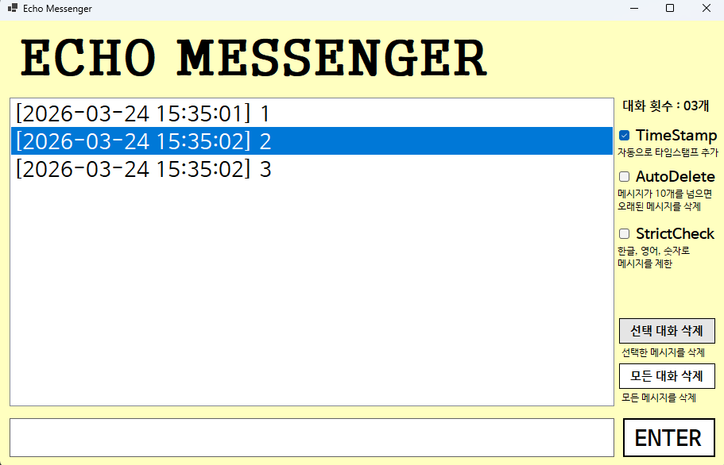

*ListBox에서 특정 항목을 선택한 뒤 '선택 대화 삭제'가 가능합니다.*

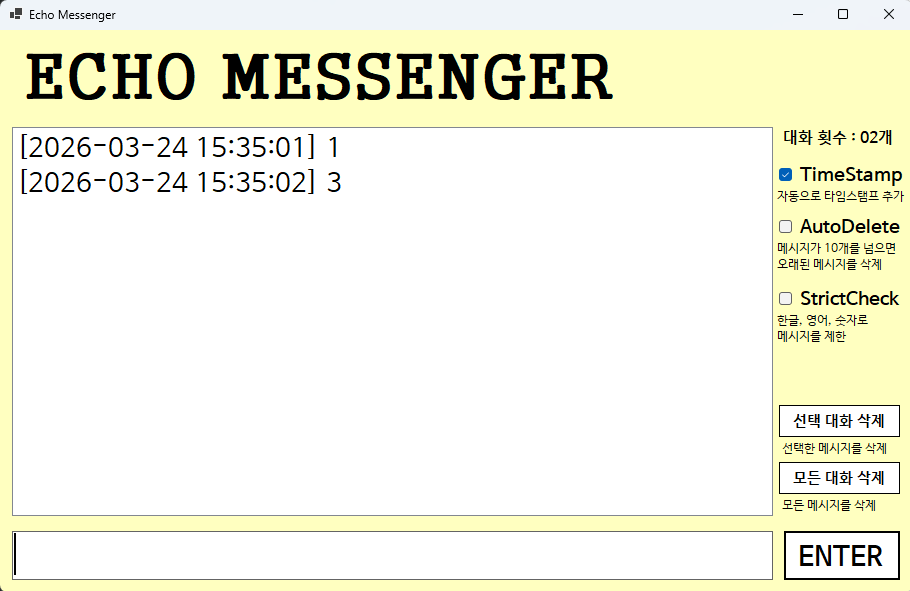

*'선택 대화 삭제' 기능으로 선택한 대화를 삭제한 화면입니다.*

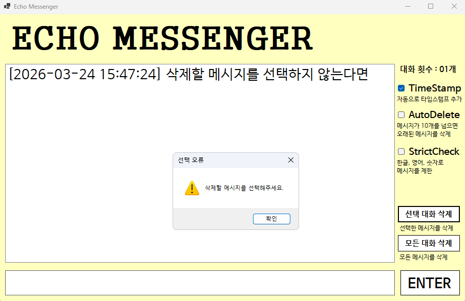

*삭제할 대화를 선택하지 않고 버튼을 클릭하면 경고창을 출력합니다.*

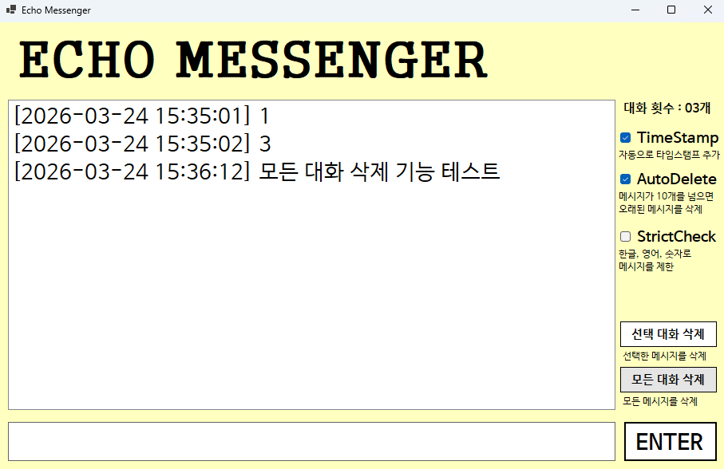

*모든 대화 삭제 기능을 테스트하기 위한 준비*

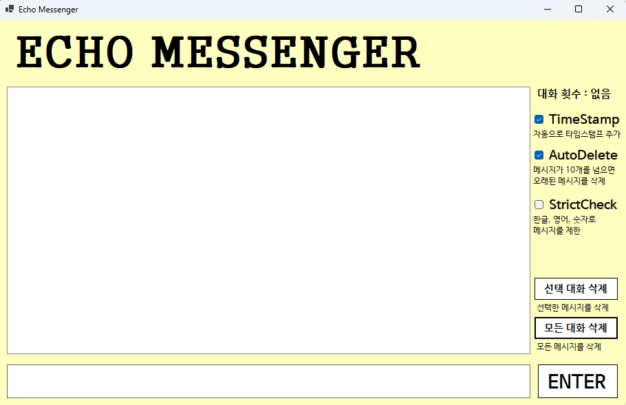

*'모든 대화 삭제' 버튼을 클릭하면 모든 대화가 삭제되며, 메시지 개수 Label도 갱신됩니다.*

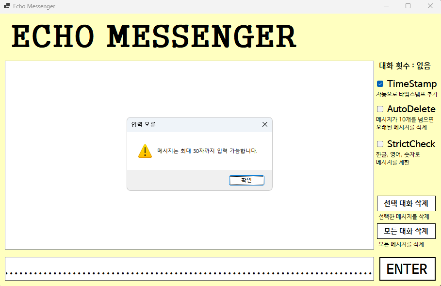

*메시지 길이를 체크하여 30자를 넘을 시 경고창을 출력하고 메시지 전송을 차단합니다.*

- 과제 내용
	- ListBox에서 특정 메시지를 마우스로 클릭하고 '삭제' 버튼을 누르면 해당 항목만 목록에서 제거합니다.
	- '대화 기록 삭제' 버튼을 클릭하면 리스트의 모든 내용을 한 번에 지웁니다.
	- 입력창에 글자 수를 50자로 제한하고, 초과시 사용자에게 경고 메시지를 띄우거나 전송을 차단합니다.

- 구현 내용과 기능 설명
	- 선택 삭제 시 항목이 선택되지 않았으면 결고창을 출력한 후 삭제를 중단합니다.
	- 전체 삭제 버튼은 ListBox를 초기화하고 메시지 횟수 Label을 0으로 갱신합니다.
	- 입력 길이 검증 로직으로 최대 길이 초과 메시지 전송을 차단합니다.
	- 입력 길이는 30으로 제한하였습니다.
	- 검증 실패 시 입력창 SelectAll/Focus로 즉시 재입력 가능하게 처리했습니다.

## 추가 기능 (개인적 추가)

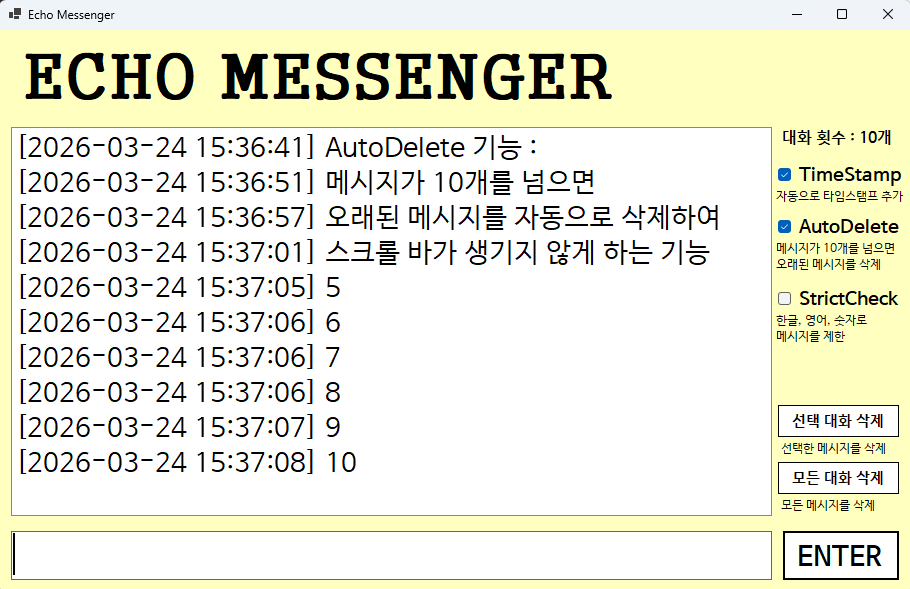

*추가 기능인 AutoDelete 기능 테스트 화면입니다.*

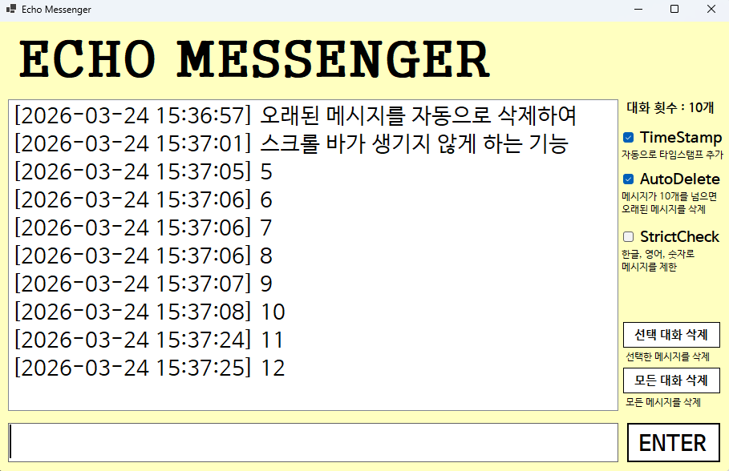

*추가로 메시지를 입력하면 오래된 메시지가 자동으로 삭제되어 스크롤 바를 만들지 않습니다.*

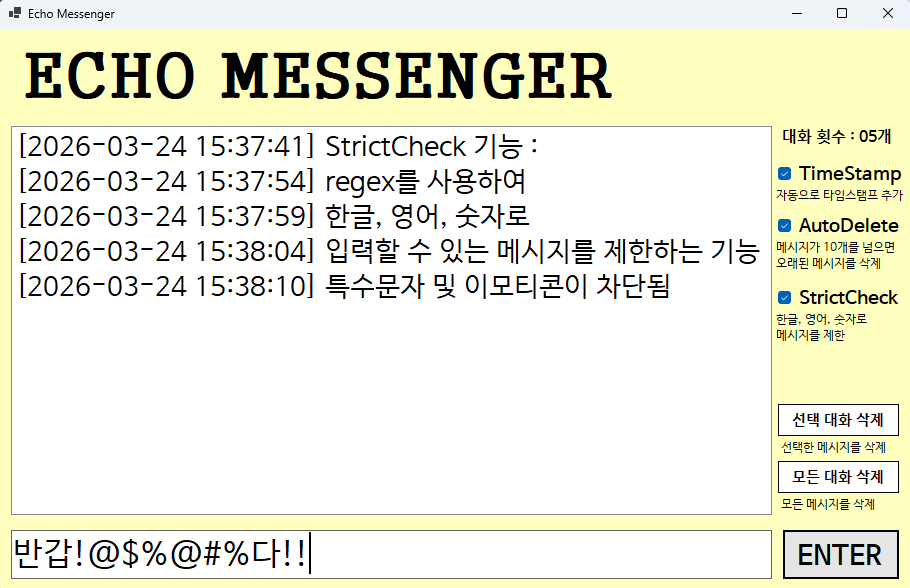

*StrictCheck 기능 테스트 화면입니다.*

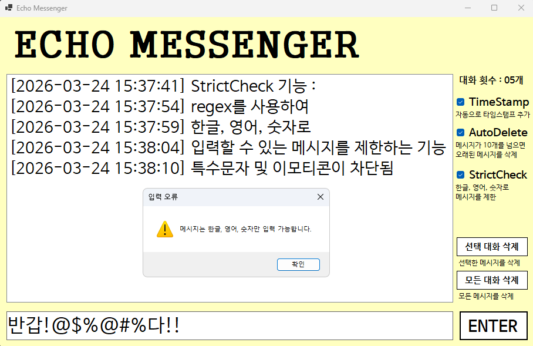

*정규식을 통해 한글/영문/숫자가 아닌 문자 전송을 차단하고 경고창을 출력합니다.*

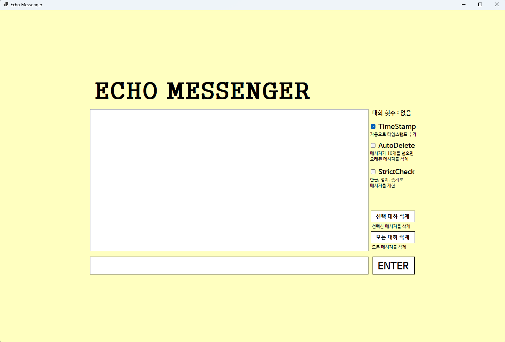

*전체 화면과 화면 크기 조정 시 자동으로 ui가 화면 정중앙을 유지합니다.*

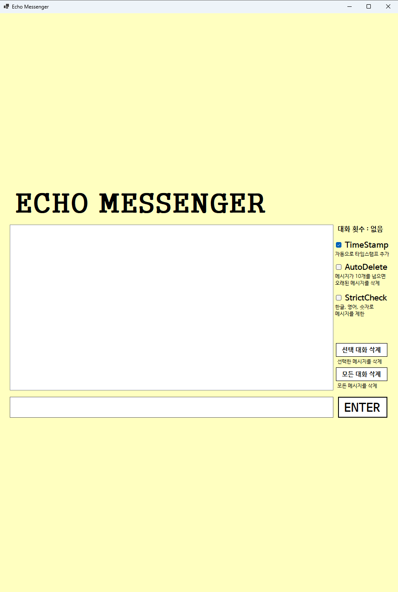

*화면 크기 조정 테스트 화면입니다.*

- 구현 내용과 기능 설명
	- AutoDelete 체크 시 메시지 개수가 10개를 넘으면 오래된 항목부터 자동 제거합니다.
	- StrictCheck 체크 시 정규식을 통해 한글/영문/숫자/공백만 허용합니다.
	- 화면 크기가 달라질 시 자동으로 ui가 화면 정중앙에 있게 하였습니다..

## 후기

기능 구현 후 시간이 좀 남아서 추가 기능을 넣어보았습니다.

README 파일 작성 시간을 분배하질 못해서 좀 미흡하긴 했으나...

집에서 시간을 들여 README 파일까지 작성 완료했네요.